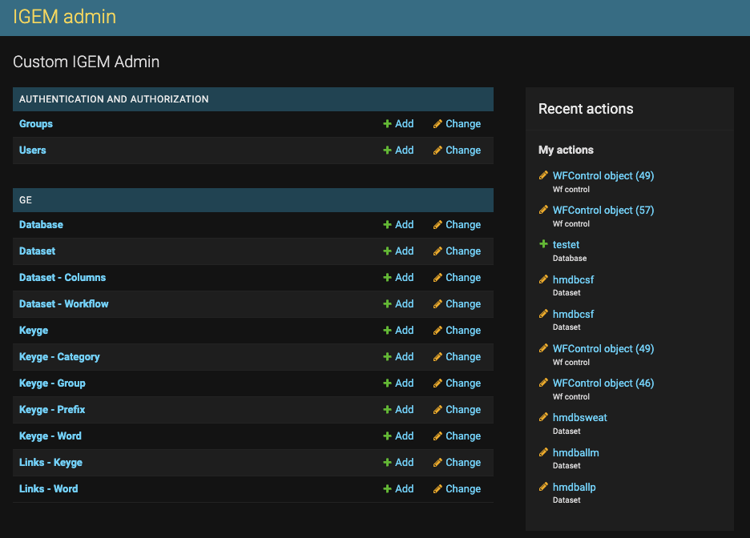
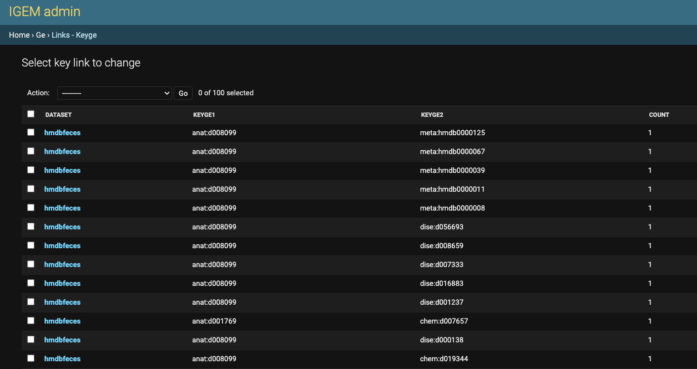

------------

------------

IGEM: 
==============================================================================

* Free software: 3-clause BSD license

Examples
--------
**Main screen for master data registration:**

|

**The query for links between terms found while ingesting an external dataset:**

Installation
------------
The IGEM system ran on Python and was built on DJANGO for database management and web interface.

To run the system, copy the /src folder to the desired location with access to Python > 3.7 and the packages described in the requirements.

The IGEM system can use any database supported by Django. You will need to set the database in the /src/src/settings.py file.

To initialize the database, type in the /src/src folder:
    > python manage.py migration

To start the sytem on web, type in the /src/src folder:
    > python manage.py runserver
=======
The IGEM system ran on Python and was built on DJANGO for database management and web interface.

To run the system, copy the /src folder to the desired location with access to Python > 3.7 and the packages described in the requirements.

The IGEM system can use any database supported by Django. You will need to set the database in the /src/src/settings.py file.

To initialize the database, type in the /src/src folder:
  > python manage.py migration
>>>>>>> e6500bc0bd338947a7a8d23181c199cff6273ac9

Questions
---------

feel free to open an `Issue <https://github.com/HallLab/igem/issues>`_.

Citing IGEM
--------------
